# 概率论

泊松分布：P{X=k}=λ<sup>k</sup>/k! * e<sup>-λ</sup>，其中λ>0且为常数，称X为服从参数λ的泊松分布，记为X~Π（λ），泊松分布是二项分布n取极限的情况

而随着单位时间内随机事件发生次数的增加，泊松分布会逐渐近似于均值和方差都等于λ的正态分布

密度函数和分布函数和边缘分布函数

分布函数：设X是一个随机变量，x是任意实数，函数F (x) = P {X<=x} 称为X的分布函数，当X为连续型随机变量时，F（x）的分布函数如下，其中f（x）成为概率密度或密度函数
$$
F(x)=\int_{-∞}^{x}f(t)dt
$$


边缘分布函数:
$$
F_X(x)=P(X<=x)=P(X<=x,Y<+\infty)
$$

$$
F_X(x)=\lim_{y \to +\infty} F(x,y)
$$

$$
F_Y(y)=P(Y<=y)=P(Y<=y,X<+\infty)
$$

$$
F_Y(y)=\lim_{x \to +\infty} F(x,y)
$$

边缘分布律
$$
f_X(x)=\int_{-∞}^{+∞}f(x,y)dy
$$
大数定律：若X1,X2,...Xn,...是随机变量序列，如果存在常数列a1,a2,...，使对任意的ε>0，有

lim<sub>n->+∞</sub>P{ |ΣXi / n-a<sub>n</sub> |<ε }=1，则称随机变量序列{Xi}服从大数定律

切比雪夫大数定律：若X1,X2,...Xn,...是一列两两不相关的随机变量，设它们方差有界，则对任意的ε>0，有

lim<sub>n->+∞</sub>P{ |ΣXi / n- Σ E (Xi) / n |<ε }=1

马尔可夫大数定律：对任意的随机变量序列{Xi}，若有 1/n<sup>2</sup>*D(Σ Xi<sup>2</sup>)趋于0,则{Xi}服从大数定律，则对任意的ε>0，有

lim<sub>n->+∞</sub>P{ |ΣXi / n- Σ E (Xi) / n |<ε }=1

对于马尔可夫大数定律来说，它已经没有任何同分布、独立性、不相关的假定了，切比雪夫大数定律可看作马尔可夫大数定律的特例

辛钦大数定律：若X1,X2,...Xn,...是一列独立同分布的随机变量，且数学期望E(Xi)=a存在，则对任意的ε>0，有

lim<sub>n->+∞</sub>P{ |ΣXi / n- a }=1


中心极限定理：设随机变量X1,X2,...Xn,...相互独立且服从同一分布，具有相同的数学期望和非零方差，部分和的标准化随机变量Zn的分布函数为Fn(x)，则

lim<sub>n->+∞</sub>Fn(x)=lim<sub>n->+∞</sub> P{Zn<=x} = ∫<sub>-∞</sub><sup>x</sup> 1/（2Π )<sup>1/2</sup>*e<sup>-t^2</sup> /2* dt = Φ(x)

这个定理表明，虽然我们很难求出X1+X2+..+Xn的确切分布，但当n充分大时，n个独立同分布随机变量值和近似服从正态分布

协方差：Cov(X,Y)=E { [ X-E(X)]  [Y-E(Y)] } = E(XY)-E(X)E(Y)

相关系数：ρ<sub>XY</sub>=Cov(X,Y)/ sqrt(D(X) D(Y) ) 	等于0是不相关，等于1就是完全正相关，等于-1就是完全负相关


组合数计算式子
$$
\begin{pmatrix}
n\\
r\\
\end{pmatrix}=\begin{pmatrix}
n-1\\
r-1\\
\end{pmatrix}+\begin{pmatrix}
n-1\\
r\\
\end{pmatrix}~~~~~~~~~~~~~~1<=r<=n
$$
一种比较简单的理解方式是，假设n个元素有一个特殊的，分别计算取它的情况和不取它的情况，两者相加就是总的情况


### 独立和不相关的关系

独立可以推导出不相关，但是相关不能推到出独立，两个随机变量的独立性只能通过联合分布函数和边缘分布函数，或者联合概率密度和边缘概率密度来进行判断。

随机变量X， Y相互独立可以推出E(XY)=E(X)E(Y) ，也就是可以推导出两者不线性相关。

# 线性代数

矩：E(X<sup>k</sup>)	成为X的k阶原点矩

维数：非零子空间H的维数是H的任意一个基的向量个数

秩：矩阵A的秩是A的列空间的维数
//另一种表示：如果矩阵A的不等于零的子式最高阶数为r，则称r为矩阵A的秩

矩阵可逆的充要条件：
1.|A|！=0
2.因为行列式|A|等于所有特征值的乘积，所以当所有特征值均不为0时矩阵可逆
3.存在矩阵B使得AB=I，根据定义

迹：矩阵对角线上各个元素之和，为特征值之和，不随基的变换而变换

范数：满足非负性，齐次性，三角不等式，相容性
||A||>=0；（非负性）
||aA||=|a|||A||;（齐次性）
||A+B||<= ||A|| + ||B||. （三角不等式）
L0范数：矩阵中非0的个数
L1范数：矩阵中的每个元素绝对值之和
L2范数：矩阵的各个元素平方之和再开平方根

正交：当<x,y>=0（就是x和y的内积为0，x<sup>T</sup>y=0）时，称向量x，y是正交的

**正交矩阵**：正交矩阵是一个可逆的方阵U，且满足U<sup>-1</sup>=U<sup>T</sup>.

**正交矩阵性质**：1.正交矩阵的转置和两个正交矩阵的乘积是正交矩阵
						   2.U为正交矩阵的充要条件是其列向量构成R<sup>n</sup>的标准正交基，其中n为U的秩
						   3.n阶矩阵U为正交矩阵的充要条件是对于任意的向量x1，x2，都有<Ux1,Ux2>=<x1,x2>，这个性质又称为保内积


矩阵AB=BA成立的条件：A矩阵和B矩阵都是对称矩阵

线性方程组解的情况：n元线性方程组Ax=b有解的充要条件是r(A)=r(A:b)
								   设n元线性方程组Ax=b有解，即r(A)=r(A:b)=r，则方程有唯一解的充要条件是r=n，有无穷多解的充要条件是r<n


二次型主轴定理：设A是一个n x n对称矩阵，那么存在一个正交变换x=Py，它将二次型x<sup>T</sup>Ax变换为不含交叉乘积项的二次型y<sup>T</sup>Dy。定理中矩阵P的列称为二次型x<sup>T</sup>Ax的主轴，向量y是向量x在由这些主轴构造的R<sup>n</sup>空间的单位正交基下的坐标向量。

//QR分解：几何动画，绘制，仿真

#### 特征值与特征向量

相似的矩阵具有相同的特征多项式

有n个相异特征值的nxn矩阵可对角化（注意这是充分而非充要条件）

设A是nxn矩阵，其相异的特征值是λ<sub>1</sub>,λ<sub>2</sub>,...,λ<sub>p</sub>；对于1≤k≤p，λ<sub>k</sub>的特征空间维数小于等于λ<sub>p</sub>的代数重数

矩阵A可对角化的充分必要条件是所有不同特征空间的维数之和为n，即特征多项式可完全分解为线性因子，每个λ<sub>k</sub>的特征空间维数等于λ<sub>k</sub>的代数重数

#### 子空间

向量空间V的一个子空间是V的一个满足以下三个性质的子集H：

a.V中的零向量在H中；b.H对向量加法封闭，即对H中任意向量u，v和u+v仍在H中；c.H对标量乘法封闭，即对H中任意向量u和任意标量c，向量cu仍在H中

# 微积分

### 中值定理

罗尔定理

闭区间连续，开区间可导，区间端点处函数值相等，则在开区间必存在一点x使得f'(x)=0。
证明方法：当该区间函数值不全相等时则必然存在一个最大值或最小值，就是导数为0的点

拉格朗日中值定理

闭区间连续，开区间可导，则在开区间内至少存在一点x，使得 ( f(b)-f(a) ) / ( b-a )=f'(x)
证明方法：构造一个辅助函数使用罗尔定理得证

柯西中值定理

曲线由参数方程 x=F(t),y=f(t)，给出，f与F均闭区间连续，开区间可导，且F‘在区间内均不为0，则开区间(a,b)内至少存在一点x使得
( f(b)-f(a) ) / ( F(b)-F(a) )=f'(x)/F'(x)
证明方法：构造一个辅助函数使用罗尔定理得证


函数的凹凸性
f( (x+y)/2 )< ( f(x)+f(y) )/2可以判定是下凸，同时也可以根据二阶导数判断，假若二阶导大于0就是下凸，小于0就是下凹

函数的拐点：连续曲线上，凹弧和凸弧的分界点，称为曲线的拐点，如若在某临域内某点两侧二阶导异号，则该点为拐点

函数的驻点：一阶导为0的点

傅里叶变换及其逆变换：

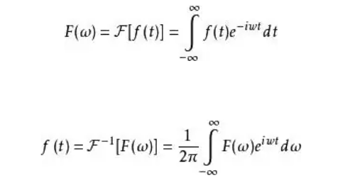

**卷积定理**：时域内的卷积对应于频域内的乘积

解析：函数在一点及其邻域上可导


### 积分方式：

黎曼积分：就是我们平时用的积分


满足区间分割越来越精细时，其和趋于极限，如下


蒙特卡洛积分：蒙特卡罗方法的基本思想是：随机抽样无限逼近，其中pdf为概率分布函数
$$
F_n(x)=\frac{1}{n} \sum_{k=1}^n\frac{f(x_k)}{pdf(x_k)}
$$


勒贝格积分：黎曼积分是把分割定义域[*a*,*b*]为较小子区间，而勒贝格积分则是分割 f的值域，或者以


 这例子来讲，黎曼积分是分割 x-轴上的定义域[a,b]，而勒贝格积分是分割 y-轴上的值域。


# 离散数学

### 关系

等价关系：A是一个非空集合，R是A上的一个二元关系，如果R满足自反性、对称性、传递性，则称R是A上的等价关系

偏序关系：A是一个非空集合，R是A上的一个二元关系，如果R满足自反性、反对称性、传递性，则称R是A上的偏序关系，并称(A,R)是一个偏序集

全序关系：R是集合A上的偏序关系，若对于x，y属于A，必有（x，y）属于R或（y，x）属于R，则称R是A上的全序关系

拓扑排序：从一个偏序构造一个与之相容的全序的过程称为拓扑排序

### 群论

格：A是一个非空集，(A,<=)是一个偏序集，若对于任意元素a,b∈A，在A中存在a和b的最小上界和最大下界，则称(A,<=)是一个格

拉格朗日定理：设G是一个有限群，H是G的一个子群，则|G|=|H|·|G : H|,其中|G : H|表示为一个群G的一个子群H的左(右)陪集的个数

### 命题

完备集：设S是联结词的集合，如果对任何命题演算公式，均有由S中的联结词表示的公式与之等价，则称S是联结词的完备集。
常见的完备集有：{!,|,&}，{!,|}, {!,&}，一个的有{↓}，其中↓表示P↓Q= ! (P|Q)		&读作合取，|读作析取


### 图论

哈密顿图：无向图中若存在一条通路经过图中的每个点一次且仅一次，则这个通路称为哈密顿通路，若哈密顿通路是一个回路，则称此回路为哈密顿圈。一个图有哈密顿圈，则称这个图为哈密顿图。

哈密顿图的必要条件：W（G-S）<=|S|，其中W(G-S)表示图G擦去S中的顶点后剩下子图的连通分支的个数

哈密顿图的充分条件：一个简单无向图G（V,E）,其中|V|=n>=3，若对于任意两个不相邻的顶点u，v∈V，d(u)+d(v)>=n，则G是哈密顿图。


欧拉图：无向图中若存在一条通路经过图中的每条边一次且仅一次，则这个通路称为欧拉通路，若欧拉通路是一个回路，则称此回路为欧拉回路。一个图有欧拉回路，则称这个图为欧拉图。

欧拉通路的充要条件：一个没有孤立点的无向图具有欧拉通路，当且仅当它是连通的，并且没有奇数度的顶点或有且仅有2个奇数度的顶点。

欧拉回路的充要条件：当且仅当所有节点均为偶数度


哈夫曼树：

对于每个树叶都有一定权重，其中具有最小权的一颗二分数称为最优树，也成为Huffman树


欧拉公式：对任意一个连通的平面图G=（V,E）,|V|=n , |E|=m ,则有n-m+r=2


马尔科夫链

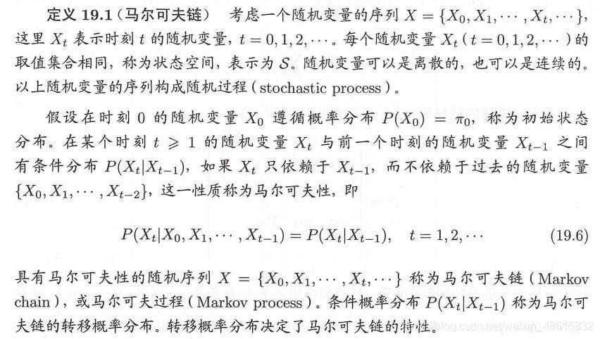

如何判断两个无穷集合：能建立起双射关系，大小即是相等。如果仅存在单射

**c++多态性，泰勒展开和傅立叶变换的概念以及他们在计算机领域中的应用**


# 数据结构

完全二叉树与满二叉树区别：
这里其实涉及些中文翻译的问题出现很多地方的混淆，下面自己用英文做解释：
Full Binary Tree：Every node except the leaf nodes have two children.  除了叶子结点之外的每一个结点都有两个孩子结点

Perfect Binary Tree：Every node except the leaf nodes have two children and every level (last level too) is completely filled. 
除了叶子结点之外的每一个结点都有两个孩子，每一层(当然包含最后一层)都被完全填充

Complete Binary Tree：Every level except the last level is completely filled and all the nodes are left justified. 
除了最后一层之外的其他每一层都被完全填充，并且所有结点都保持向左对齐


# 算法

### 排序算法

#### 直接插入排序

在待排序的元素中，假设前n-1个元素已有序，现将第n个元素插入到前面已经排好的序列中，使得前n个元素有序。按照此法对所有元素进行插入，直到整个序列有序

#### 选择排序

选择排序，即每次从待排序列中选出一个最小值，然后放在序列的起始位置，直到全部待排数据排完即可

#### 冒泡排序

冒泡排序，该排序的命名非常形象，即一个个将气泡冒出。冒泡排序一趟冒出一个最大（或最小）值

#### 堆排序

先建一个堆，再每次提取堆顶元素即可

#### 归并排序

可以看作是有序序列的合并

#### 快速排序

找一个哨兵，找出它的正确位置，将其左右剩余元素再分别进行快速排序

#### 桶排序

如果要排序的数据有 n 个，我们把它们均匀地划分到 m 个桶，每个桶都有k=n/m个元素。如果桶内部使用快速排序的话，那每个桶内排序的时间复杂度为O(k*logk),m个桶进行排序的时间复杂度为O(m*k*logk)。因为k=n/m，所以整个桶排序的时间复杂度为O(n*logn/m)。当桶的个数m接近数据个数n时，logn/m就是个非常小的常数，这时候桶排序的时间复杂度就是O(n)。

#### 基数排序

基数排序的主要思路是，将所有待比较数值(必须是正整数)统一为同样的数位长度,数位较短的数前面补零(补零一般不影响排序结果，如果出现影响排序结果的话，就要考虑如何处理)。然后, 从最低位开始, 依次进行一次稳定排序(因为每个位可能的取值范围是固定的从0到9).这样从最低位排序一直到最高位排序完成以后, 数列就变成一个有序序列
每一位排序，我们可以用刚讲过的桶排序或者计数排序，它们的时间复杂度为O(n)。我们要排序的数据有k位，那么算法总的时间复杂度就为O(k*n)


#### 各种排序算法的比较

| 算法         | 时间复杂度 | 空间复杂度 |
| ------------ | ---------- | ---------- |
| 直接插入排序 |            |            |
| 选择排序     |            |            |
| 冒泡排序     |            |            |
| 堆排序       |            |            |
| 归并排序     |            |            |
| 快速排序     |            |            |
|              |            |            |

不稳定的排序：堆排序，选择排序，快速排序，希尔排序

稳定的排序：冒泡排序，归并排序，插入排序，基数排序


### 最短路

#### 单源最短路：Dijkstra

一个贪心算法，初始化一个原点，每次迭代，选取一个距离最小的点从剩余点集合中加入该集合，并根据此点的临界情况对剩余点进行更新。时间复杂度为O（n<sup>2</sup>），用最小堆进行改进的话时间复杂度可为O（mlog n），如果是稠图，甚至还可以O（m）的复杂度

#### 多源最短路：Floyd

一个动态规划算法，时间复杂度O（n<sup>3</sup>），空间复杂度O（n<sup>2</sup>）

动态规划范式：
$$
d^k_{i,j}=l[i,j]~~~~~~~~~~~~~~当k=0时
$$

$$
d^k_{i,j}=min(d^{k-1}_{i,j},d^{k-1}_{i,k}+d^{k-1}_{k,j})~~~~当1<=k<=n时
$$


### 最小生成树

#### Kruskal

找最小边，选取最小边的时候根据并查集判断是否回边

#### Prim

以一个点为原点生成一个集合，每次判断距离集合最近的点

##### prim算法和dijkstra算法的区别

1.Prim算法解决的问题是连通无向有权图中最小生成树问题，而Dijkstra算法解决的问题是源点到目标点的最短路径问题。

2.虽然这两个算法在添加新结点时，都是选择“距离最短”的结点加入集合，但是Prim算法中，“距离最短”是指未访问的结点到已经访问的所有结点距离最小，即将已经访问的结点视为一个整体，将距离最小的结点加入到已访问的集合中；而在Dijkstra算法中，“距离最短”是指所有未访问结点（通过已访问的结点）到源点距离最小。

3.在Prim算法中，数组元素dis[i]表示未访问结点i到已访问结点集合的最短距离，所以此时需要记录最短距离。而Dijkstra算法中，数组元素dis[i]表示未访问结点i到源点的最短距离。


### 连通分量

连通分量内顶点间能够相互到达


### 拓扑排序

拓扑排序是一个有向无环图的所有顶点的线性序列。且该序列必须满足下面两个条件：

每个顶点出现且只出现一次；若存在一条从顶点 A 到顶点 B 的路径，那么在序列中顶点 A 出现在顶点 B 的前面。


### 杂篇

Q:如何用空间复杂度为O（1）的算法判断单链表是否有环？

A:快慢指针判断法：设置两个指针，从同一个起点出发，一个速度为2个节点/次，一个速度为1个节点/次，
如果这个链表内不存在环。那么慢指针永远追不上快指针，直到快指针先遍历到NULL，退出循环，判断结束，输出false
如果这个链表内存在环，那么慢指针和快指针一定会一直绕环移动，并且某个时刻一定会重合，此时判断结束，输出true

# 操作系统

进程与线程的区别：进程是操作系统资源分配的基本单位，而线程是处理器任务调度和执行的基本单位

页表：页表是一种数据结构，将虚拟地址（实际上是虚拟页号）映射到物理地址（物理帧号）


```
https://blog.csdn.net/weixin_43436958/article/details/105347806?ops_request_misc=&request_id=&biz_id=102&utm_term=2021%E5%B9%B4%E5%8C%97%E4%BA%AC%E8%88%AA%E7%A9%BA%E8%88%AA%E5%A4%A9%E5%A4%A7%E5%AD%A6%E5%A4%8F%E4%BB%A4%E8%90%A5&utm_medium=distribute.pc_search_result.none-task-blog-2~all~sobaiduweb~default-8-105347806.142^v31^pc_rank_34,185^v2^control&spm=1018.2226.3001.4187
```


1. 编译好的程序到内存运行时，生成地址经过了几次转换

   进程和线程通信

### 进程通信

#### 六种通信方式

管道（无名管道pipe | 和命名管道FIFO），消息队列（MessageQueue），共享存储（SharedMemory），信号量（Semaphore），套接字（Socket），信号（signal）


#### 按照通信方式区分

共享存储器系统，管道通信系统，消息传递系统，客户机服务器系统


### linux开机

BIOS 上电自检（POST）
引导装载程序 (GRUB2)
内核初始化
启动 systemd，其是所有进程之父


### 线程通信

共享内存：线程间共享程序的公共状态，用关键词volatile来保证内存的可见性

消息传递

管道通信


# 编译原理

LL(1)：第一个L表示从左向右扫描输入，第二个L表示产生最左推导，1表示在每一步中只需要向前看一个输入符号来决定语法分析动作

LR(1)：L表示从左向右扫描输入，R表示反向构造出一个最右推导序列，1表示在做出语法决定时向前看1个输入符号


### 文法

0型文法：每个产生式α->β是这样一种结构，α∈(V<sub>N</sub>UV<sub>T</sub>)<sup>\*</sup>且少含有一个非终结符，而β∈(V<sub>N</sub>UV<sub>T</sub>)<sup>*</sup>，则G是一个0型文法

1型文法或上下文有关的：每个产生式α->β均满足|β|>=|α|，仅仅S->ε 除外，则G是一个1型或上下文有关的文法

2型文法或上下文无关的：每个产生式α->β均满足：α是一个非终结符，β∈(V<sub>N</sub>UV<sub>T</sub>)<sup>*</sup>，则G是一个2型或上下文无关的文法

3型文法或正规文法：每个产生式的形式都是A->aB或A->a,其中A和B都是非终结符，a∈V<sub>T</sub>,则G是3型文法或正规文法

四种文法的定义是逐步增加限制的，因此每一种文法都包含上一层文法的属性


### 短语 句柄

句柄：一个句型的最左直接短语称为句柄

直接短语：比如存在规则A->a，则称为a是规则A->a的直接短语

短语：对于一非终结符其能在有限步内推导出一终结符，则成该终结符是该非终结符的短语


### DFA化简

NFA转DFA：子集法

DFA化简：

1. 首先将DFA的状态分成为两个子集，一个是由终态组成，一个是由非终态组成

				   2. 对于任何子集，输入符号，检测读入后子集内部是否仍等价，比如转换的状态仍在此子集中，否则就对子集进行分割
				   2. 重复2步骤，直至无法分割为止


### 自底向上分析法

自底向上分析的策略：移进-归约分析

#### 简单优先分析法

实现步骤

1.拓广文法

2.构造优先关系表

3.判定是否为简单优先文法（优先关系表中任意两符号间至多只有一种关系）

4.根据优先关系表分析句子


分析过程

1.输入符号串至符号栈中，直至栈顶符号大于下一输入符号为止；

2.以当前符号为句柄尾，在栈中往前找到一个头符号小于再往前一个符号为止

3.此为句柄，找出产生式右部为其的产生式并用左部替换，若未找到即可判定该输入串不是该文法的句子

4.重复上述三步直至归约完成为止


#### 算符优先分析法

算符文法中任何句型都不包含两个相邻的非终结符

算符优先文法进行归约时，只需要将当前句柄归约成一非终结符，与非终结符无关，即 将所有的非终结符看作是一种，算符优先表中也只含有终结符

也因为不考虑非终结符是什么，所以也有可能出现错误的句子得到正确的归约

最左素短语：一个句型的素短语是一个短语，它至少包含一个终结符，而且除自身外不再包含其他素短语，句型最左边的素短语称为最左素短语（提出这个概念是用来找句柄的）


规范归约：规范归约是最右推导的逆过程


### LR分析

优点：文法限制少，速度快，能准确、及时指出错误位置

缺点：构建文法分析器工作量大


活前缀和可归前缀：在规范句型中形成可归前缀之前包括可归前缀在内的所有前缀称为可归前缀


LR(0)：构建ACTION和GOTO表，一种很普通的有限状态机

SLR(1)：当LR(0)产生移进-归约或者归约-归约冲突时，向前看一个符号，看其是否在对应归约式左边的符号的FOLLOW集中，是就归约，不是就移入

SLR(1)的问题：对于归约项目A->α. 只要α属于follow (A)，就用A->α归约。如果栈里是βα，归约后变为βA，再移进符号a，栈里变成βAa，其未必是规范句型活前缀，从而引出LR(1)

LR(1):若项目集 A→α•Bβ 属于项集I时，则 B→•γ 也属于项集I，把 FIRST(b) 作为用产生式归约的搜索符（称为向前搜索符），作为用产生式B→γ归约时查看的符号集合（用以代替SLR(1)分析中的FOLLOW集），并把此搜索符号的集合也放在相应项目的后面，这种处理方法即为LR(1)方法

LR(1)分析法的本质：
对某些存在冲突的项目集分裂，避免发生冲突

LR(1)分析法存在问题：
LR(1)项目集的构造对某些项目集的分裂可能使状态数目剧烈的增长

因此我们可以考虑使用采用LALR(1)分析法合并同心集


LALR(1):在LR（1）的基础上，我们合并同心集，同心集合并后心仍相同，只是超前搜索符集合为各同心集超前搜索符的合集，合并后只可能出现归约-归约冲突，不可能出现移进-归约冲突


# 数据库

### 数据模型

关系数据模型：关系模型是一种基于表的数据结构；  关系，也可以称为二维表

半结构化数据模型：包括XML和相关标准，半结构化数据类似于树或者图，而非表或数组


### 范式

第一范式：域应该是原子性的，即数据库的每一列都是不可分割的数据项（域是列的取值范围，比如性别的域就是男女）

第二范式：在1NF的基础上， 实体的属性完全依赖于主键（混合主键），不能存在于部分依赖于主键（混合主键），比如如果存在某些属性只依赖混合主键中的部分关键字，那么就不符合第二范式

第三范式：在2NF的基础上，消除了非主属性对主键的传递依赖

BCNF：每个非平凡FD的左边都是超键，一个包含键的属性集是超键


### ACID

事务(Transaction)是并发控制的基本单位。所谓事务，它是一个操作序列，这些操作要么都执行，要么都不执行，它是一个不可分割的工作单位。

数据库事务必须具备ACID特性，ACID是Atomic（原子性）、Consistency（一致性）、Isolation（独立性）和Durability（持久性）的英文缩写。

原子性（Atomic）：一个事务(transaction)中的所有操作，要么全部完成，要么全部不完成，**不会结束在中间某个环节**。事务在执行过程中发生错误，会被回滚（Rollback）到事务开始前的状态，就像这个事务从来没有执行过一样。
可通过undo log，commit，rollback进行保证

一致性（Consistency）

所有数据库中数据元组之间的联系具有一致性约束，或说满足一致性期望（例如，事务执行结束后账户余额不能是负数），即期望事务能保持数据库的一致性
可通过undo log，rollback进行保证

独立性（Isolation）

每个事务必须如同没有其他事务在同时执行一样被执行
通过MVCC（多版本并发控制）+读写锁来保证

持久性（Durability）

指的是只要事务成功结束，它对数据库所做的更新就必须**永久保存**下来。即使发生系统崩溃，重新启动数据库系统后，数据库还能恢复到事务成功结束时的状态。
可通过redo log进行保证


事务的（ACID）特性是由关系数据库管理系统（RDBMS，数据库系统）来实现的。数据库管理系统**采用日志来保证事务的原子性、一致性和持久性**。日志记录了事务对数据库所做的更新，如果某个事务在执行过程中发生错误，就可以根据日志，撤销事务对数据库已做的更新，使数据库退回到执行事务前的初始状态。

数据库管理系统**采用锁机制来实现事务的隔离性**。当多个事务同时更新数据库中相同的数据时，只允许持有锁的事务能更新该数据，其他事务必须等待，直到前一个事务释放了锁，其他事务才有机会更新该数据。


[数据库的ACID特性详解 - 简书 (jianshu.com)](https://www.jianshu.com/p/d396fffaceb6)

### 函数依赖FD

如果R的两个元组在属性$$A_1,A_2...,A_n$$上一致，那么它们必定在其他属性$$B_1,B_2,...,B_n$$上一致


### 键

1.某个属性集决定关系的所有其他属性	2.这个属性集是最小的，不含任意真子集满足1条件


超键：一个包含键的属性集就叫做超键


### 最小化基本集

给定一个FD集合S，任何和S等价的FD集合都被称为S的基本集，满足以下3个条件则被称为关系的最小化基本集

1.B中所有的FD右边均为单一属性

2.从B中删除任意一个FD后该集合不再是基本集

3.对于B中任意一个FD，如果从其左边删除一个或者多个属性，B将不再是基本集


### 异常与分解

异常的基本类型有：冗余、更新异常、删除异常

冗余：信息在多个元组中重复

更新异常：可能修改了某个元素的值但没有修改其他元素的值

删除异常：删除某一值变成空集，可能会带来其他信息丢失的副作用，特别是只有一项相关的元组时


我们一般用分解关系的方法来消除异常

如BCNF分解

BCNF分解算法：

1.检测R是否属于BCNF，属于就返回，不属于进入2

2.假若存在违例A->B，计算闭包A<sup>+</sup>，选择R<sub>1</sub>=A<sup>+</sup>作为一个关系模式，并且使用关系模式R<sub>2</sub>包含属性A以及不在A<sup>+</sup>中的元素

3.计算R<sub>1</sub>与R<sub>2</sub>的FD集合（计算方法为根据已知的FD，对R<sub>1</sub>中每个子集X，计算X<sup>+</sup>，可以得到相应的FD）

4.使用本算法递归分解R<sub>1</sub>，R<sub>2</sub>


分解的优劣

1.消除异常

2.信息可恢复

3.依赖可保持


检验是否是无损的连接chase检验：

对于分解的每个属性集，将所含属性以不带下标的a，b，c...形式以元组形式放入关系表R中，对于不含的元素以带下标的元素表示为任意值，通过给定的FD，进行代替操作，经过若干次迭代，检测时不时出现一个完全不带下表的元组，如果是就是无损，不是就不是无损。

核心思想是，连接是恢复的唯一方式，自然连接满足交换律和结合律，R中任意元组必然在各个R<sub>i</sub>的自然连接的结果之中，故我们需要检测的是对于该自然连接产生的任意元组，是不是也在R中，这就是chase检验的思想。


具有无损连接和依赖保持性质的3NF关系综合算法

输入：关系R和其上成立的函数依赖集F

方法：1.找出F的一个最小基本集记为G；

​			2.对于G中每一个FD X->A，将XA作为分解出某个关系的模式

​			3.如果第2步分解出的关系模式均不包含R的超键，则增加一个关系，其模式为R的任何一个键


### 多值依赖MVD

A<sub>1</sub>A<sub>2</sub>...A<sub>n</sub> ->-> B<sub>1</sub>B<sub>2</sub>...B<sub>m</sub>

左右两侧相互独立，即对R中每个在A属性上一致的元组对t和u，都能在R中找到满足下列条件的元组v，使得

1.在A属性上的取值与t和u相同

2.在B属性上的取值与t相同

3.在不属于A和B的所有其他属性上取值与u相同


MVD新规则

1. FD升级（FD promotion）规则，每个FD都是MVD，也就是说，如果有A<sub>1</sub>A<sub>2</sub>...A<sub>n</sub> -> B<sub>1</sub>B<sub>2</sub>...B<sub>m</sub>成立，那么A<sub>1</sub>A<sub>2</sub>...A<sub>n</sub> ->-> B<sub>1</sub>B<sub>2</sub>...B<sub>m</sub>也成立
2. 互补规则（complementation rule），若关系R上存在MVD A<sub>1</sub>A<sub>2</sub>...A<sub>n</sub> ->-> B<sub>1</sub>B<sub>2</sub>...B<sub>m</sub>，则R上也存在A<sub>1</sub>A<sub>2</sub>...A<sub>n</sub> ->-> C<sub>1</sub>C<sub>2</sub>...C<sub>k</sub>，其中C是R中不属于A和B的所有其他属性的集合


### 隔离层次

可串行化：事务必须完全在另一个事务之前或之后运行

可重复读：查询得到的每个元组如果在此查询在此执行时必须重现

读提交 ：只有那些被已提交事务写入的元组才可以被这个事务看到

读未提交：对事务可以看到的信息不加限制

| Isolation Level  | Dirty Reads | Nonrepeatable Reads | Phantoms    |
| ---------------- | ----------- | ------------------- | ----------- |
| Read Uncommitted | Allowed     | Allowed             | Allowed     |
| Read Committed   | Not Allowed | Allowed             | Allowed     |
| Repeatable Read  | Not Allowed | Not Allowed         | Allowed     |
| Serializable     | Not Allowed | Not Allowed         | Not Allowed |

脏读: 对于两个事务 T1, T2, T1 读取了已经被 T2 更新但还没有被提交的字段. 之后, 若 T2 回滚,T1读取的内容就是临时且无效的

不可重复读: 对于两个事务T1, T2, T1 读取了一个字段, 然后 T2 更新了该字段. 之后,T1再次读取同一个字段, 值就不同了

幻读: 对于两个事务T1, T2, T1 从一个表中读取了一个字段, 然后 T2 在该表中插入了一些新的行. 之后, 如果 T1 再次读取同一个表, 就会多出几行

### 视图

虚拟视图是由其他关系上的查询所定义的一种关系，其不会在数据库中进行存储。

当对通过视图看到的数据进行修改时，相应的基本表的数据也要发生变化。同时，若基本表的数据发生变化，则这种变化也可以自动地反映到视图中。

视图是一种”虚表”，所以不能与已经存在的表重名

(PS:在使用表或者视图的情况下用术语“关系”，强调一个关系是被存储时用表)


使用视图的优缺点：

1.使用视图，可以定制用户数据，聚焦于特定数据

2.简化操作，比如sql语句便于书写

3.mysql对于视图的优化并不完善，这样说并不准确，准确的说，应该是mysql对于子查询的优化不是很好，而使用视图本身往往就意味着使用子查询，所以，如果我们必须使用视图时，最好将视图中的sql语句尽量优化，或者说，数据量大的时候尽量避免使用视图


子查询：用在where或者from上的SELECT查询语句

# 机器学习

BP算法（Back Propagation）

BP算法由信号的正向传播和误差的反向传播两个过程组成。

正向传播时，输入样本从输入层进入网络，经隐层逐层传递至输出层，如果输出层的实际输出与期望输出(导出信号)不同，则转至误差反向传播；如果输出层的实际输出与期望输出(导师信号)相同，结束学习算法。

反向传播时，将输出误差(期望输出与实际输出之差)按原通路反传计算，通过隐层反向，直至输入层，在反传过程中将误差分摊给各层的各个单元，获得各层各单元的误差信号，并将其作为修正各单元权值的根据。这一计算过程使用梯度下降法完成，在不停地调整各层神经元的权值和阈值后，使误差信号减小到最低限度。

权值和阈值不断调整的过程，就是网络的学习与训练过程，经过信号正向传播与误差反向传播，权值和阈值的调整反复进行，一直进行到预先设定的学习训练次数，或输出误差减小到允许的程度。


SVM

线性不可分，加入软间隔，对每个样本点引入一个松弛变量

或者我们可以通过特征空间映射，将低维不可分问题转换为高维线性可分	


交叉熵损失函数

y= - yi标签值*log yi预测值


卷积定理：

时域上的卷积等于频域上的乘积


为什么计算损失函数最优值采用梯度下降而非直接求导？

比如我们那线性回归举例，线性回归通过其代价函数对θ求导使其为0得出$$\theta=(X^TX)^{-1}X^TY$$，

而X的转置乘以X必须要可逆，也就是X必须可逆，但是实际情况中并不一定都满足这个条件，因此直接求导不可行；
假设满足了上面的条件，那么就需要去求X的转置乘以X这个整体的逆，线性代数中给出了求逆矩阵的方法，是非常复杂的(对计算机来说就是十分消耗性能的)，数据量小时，还可行，一旦数据量大，计算机求矩阵的逆将会是一项非常艰巨的任务，消耗的性能以及时间巨大，而在机器学习中，数据量少者上千，多者上亿；因此直接求导不可行。

求逆的方法：$$X^{-1}=\frac{adj(X)}{|Det(X)|}$$,其中adj(X)是X的伴随矩阵，每一元素都是对应位置的代数余子式


### Softmax回归

单层线性神经函数

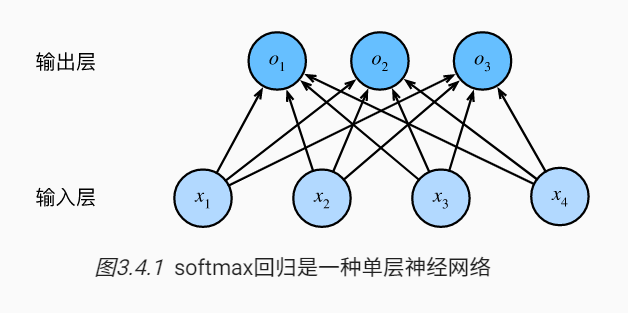

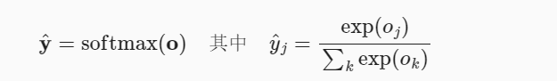

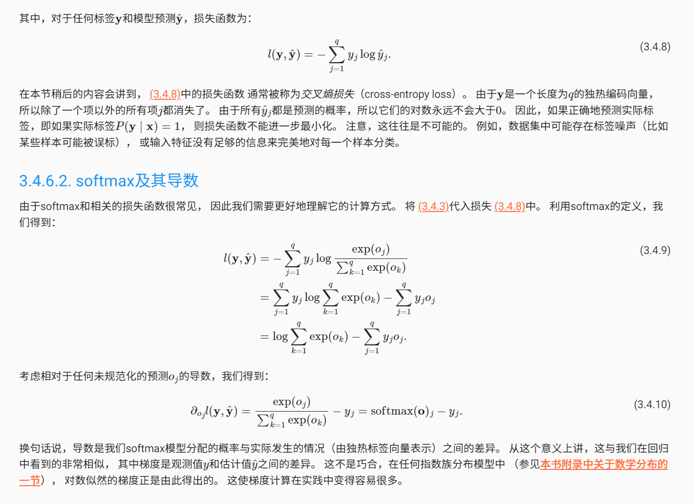


### MLP

MLP：多层感知机

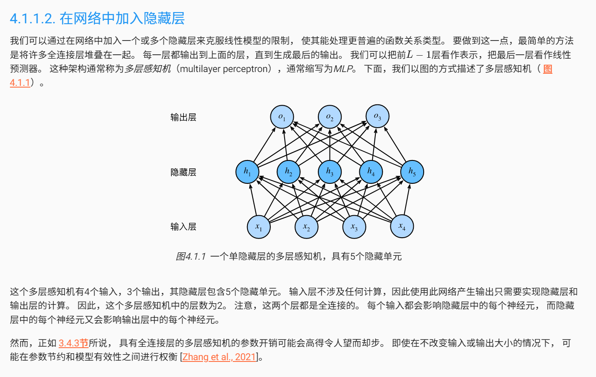

相较于Softmax多了若干层非线性隐藏层，激活函数有ReLU，tanh，sigmoid等

ReLU(x)=max(x,0)

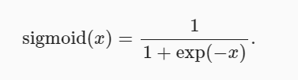

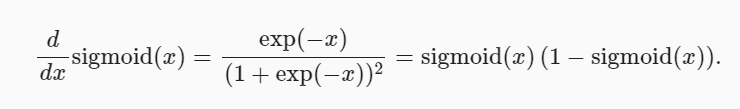

其中注意一下sigmoid的导数的值的特殊性


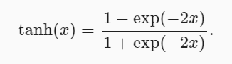

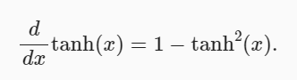

### K-Means

优点：原理简单；收敛快；调参只需要调簇数k；模型可解释性强

缺点：k的选取不好把握；由于采用的是迭代的方法，只能收敛到局部最优解；如果数据集非凸则比较难收敛；对噪声和异常点比较敏感


# 计算机网络

arp请求和响应报文有什么区别：
arp请求报文是广播，请求对应IP的MAC地址时同时附带了自己的IP与MAC地址
arp响应报文是单播，将自己的MAC地址发回发出请求的主机

大端存储：高字节数据存储在低地址，网络中数据传递经常用到

小段存储：低字节数据存储在低地址，一个字节内的数据顺序都是小段


### 交换机和路由器的区别

1.OSI模型中所处的位置不同，交换机工作在数据链路层，而路由器工作在网络层

2.寻址方式不同，交换机根据mac地址寻址，路由器根据IP地址寻址

# 计算机组成原理

PCI几种总线几种接口


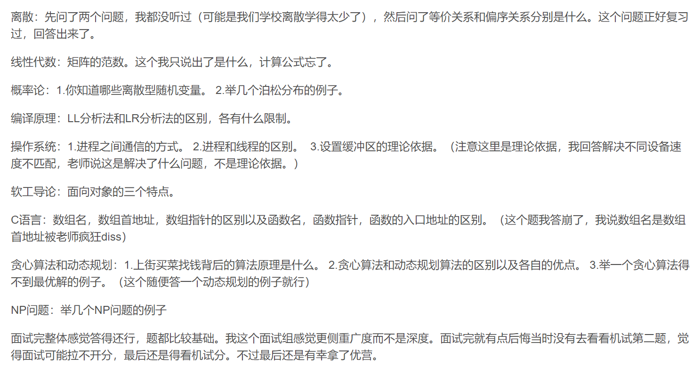


# 计算机体系结构

定义：计算机系统结构是机器语言（含汇编语言）程序员所看到的计算机的属性，即概念性结构与功能特性。确定软硬件的交界面。其界面之上是软件的功能，界面之下是硬件和固件的功能。


### Tomasulo算法

核心思想：记录和检测指令相关，操作数一旦就绪立刻执行，将发生RAW冲突的可能性降到最低；我们可以通过寄存器换名来消除WAW以及WAR冲突（这些冲突都是来自于乱序执行）

 


# C++

c的结构体中不能定义函数，但是可以有函数指针。C++的结构体中可以定义函数

静态全局变量限制了其作用域在定义该变量的源文件内有效，要是想在其他文件中生效需要加extern，而static修饰局部变量时，表明该变量的值不会因为函数终止而丢失

内存四区：代码区，全局区，堆区，栈区
全局区：全局常量，全局变量，静态变量，字符串常量


### malloc/free与new/delete的异同：

malloc和new都是在堆上开辟内存的，但是malloc是函数，而new是运算符号

new 先在堆上申请对象空间，再调用构造函数初始化对象； delete 先调用析构函数 ，再释放对象空间；而malloc/free只是单纯的开辟/销毁空间并不会去调用构造/析构函数。

new处理错误的方式是抛异常（错误的方式，例如：开辟的空间太大，无法满足要求），如果异常不被捕获，将直接终止程序。而malloc处理错误的方式是将指针置空+错误码。

malloc的返回值为void*, 在使用时必须进行强制类型转换，而new不需要，因为new后跟的是空间的类型


### 引用与指针有什么区别：

引用创建时必须同时被初始化，指针可以在任何时候初始化。

引用初始化后不能改变引用关系，指针能随时改变所指的对象。

不存在指向空值的引用，但是存在指向空值的指针。


### 类中使用const数据成员

不能在类声明中初始化 const 数据成员。const 数据成员的初始化只能在类构造函数的初始化表中进行。


### 面向对象的三个特点：

封装
继承
多态：在c++我们可以通过使用virtual作用于函数的动态绑定从而实现运行时多态，而编译时多态可以通过函数重载和运算符重载来实现

如果一个类被继承，同时定义了基类以外的数据成员对象，且基类析构函数不是virtual修饰的，那么当基类指针或引用指向派生类对象并析构时，会调用基类的析构函数而导致派生类定义的数据成员没有被析构，产生内存泄漏问题。所以用于基类的析构函数最好用virtual，如果里面写了东西也会被调用


### 为什么需要使用堆，使用堆空间的原因

因为直到运行时才知道一个对象需要多少内存空间，而且不知道对象的生存期有多长


### 浅拷贝和深拷贝

对于对象，浅拷贝只是拷贝一个指针，而深拷贝是完全拷贝一个对象，浅拷贝问题在于析构的时候可能重复释放内存导致程序崩溃


# 概率论题目

### 一根绳子砍成三段，可以组成三角形的概率

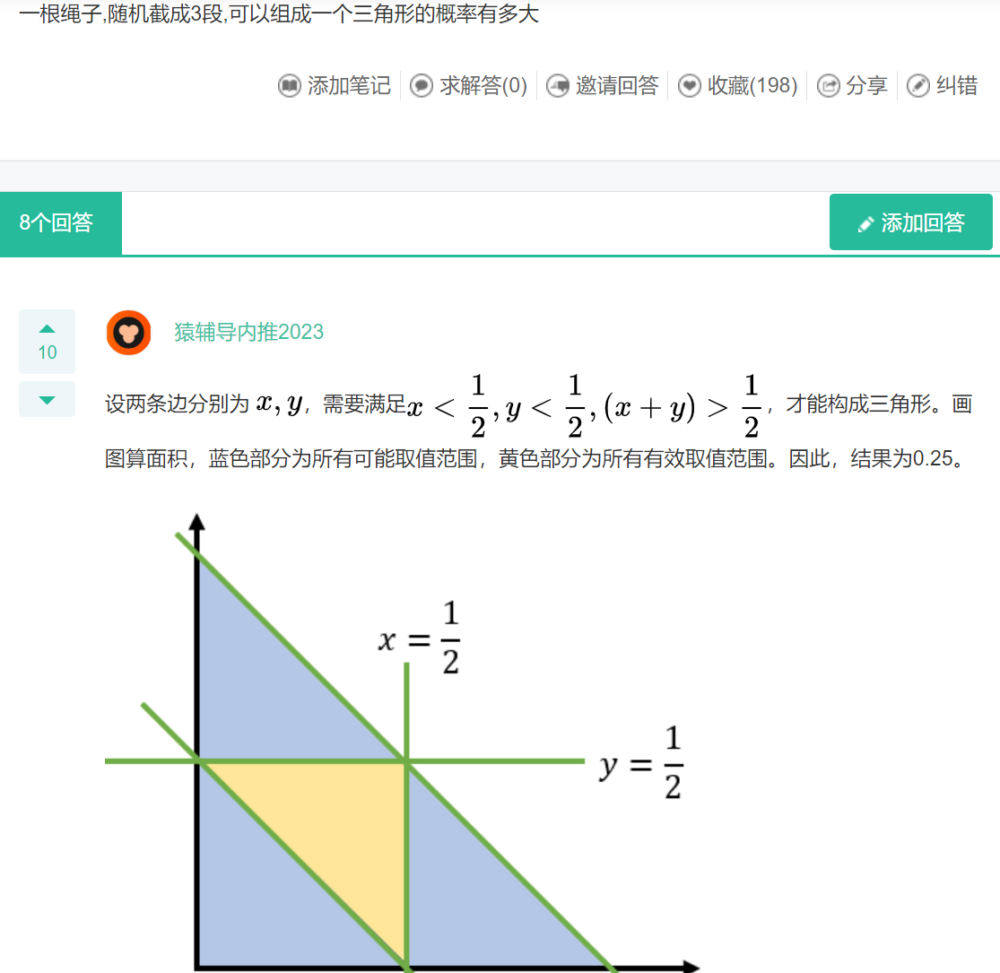

### 不相关且不独立

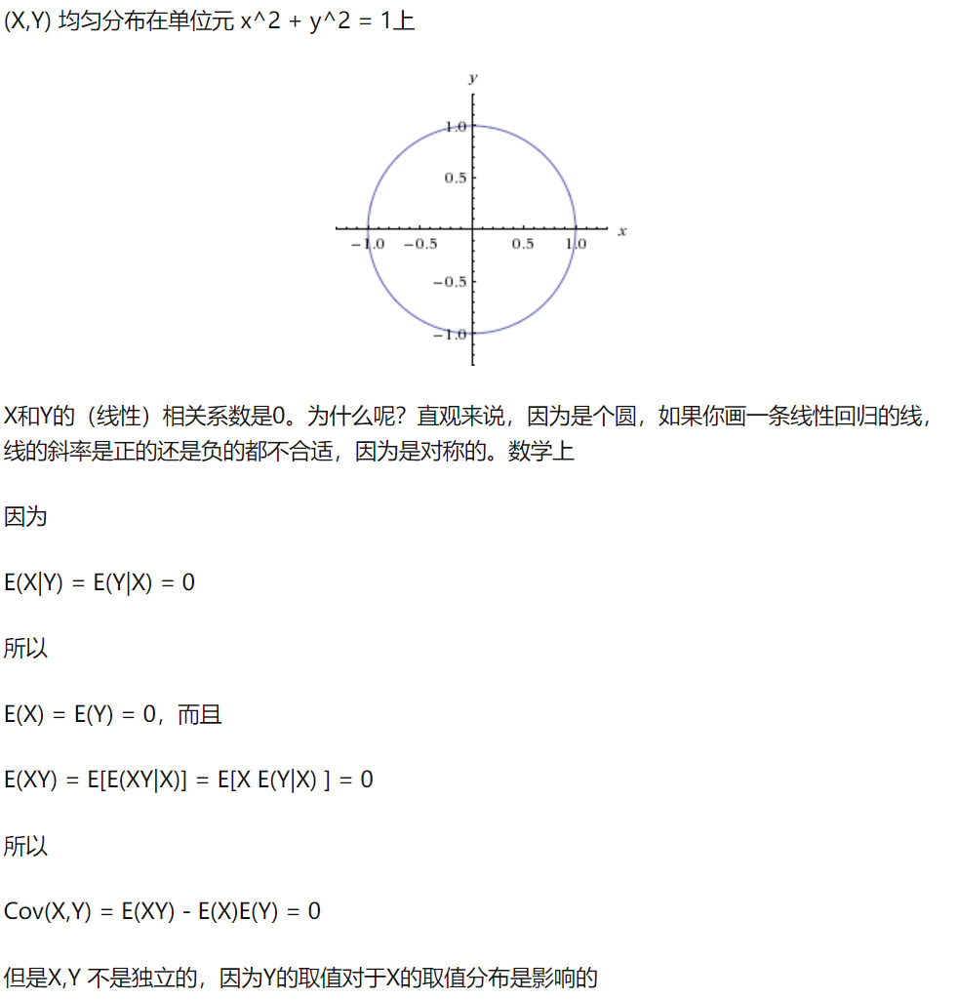


